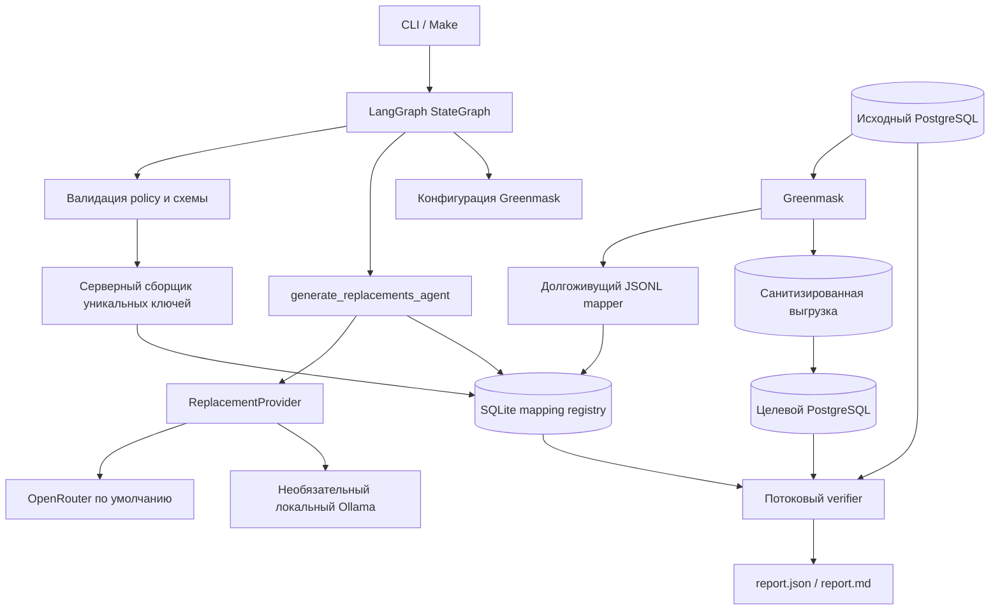

# Архитектура DB Sanitizer

## Назначение

DB Sanitizer создаёт санитизированную копию PostgreSQL для разработки, тестирования и аналитики. Политика явно перечисляет чувствительные текстовые столбцы; инструмент не обнаруживает PII автоматически и не обрабатывает свободный текст или документы.

Главные инварианты:

- исходные PII не сохраняются в реестре, логах, состояниях LangGraph или отчётах;
- LLM получает только тип сущности, локаль, число значений и ограничения формата;
- одно нормализованное исходное значение внутри consistency group всегда получает одну замену;
- отсутствие mapping, ошибка преобразования или обязательной проверки завершают запуск с ошибкой;
- обработка строк и проверка сопоставлений используют ограниченные пакеты, а не полный набор строк в Python-памяти.

## Компоненты



Исходник диаграммы: `templates/architecture.mmd`.

## Плоскости выполнения

### Управляющая плоскость

LangGraph выполняет строго линейный граф:

```text
load_policy
  -> inspect_schema
  -> collect_mapping_keys
  -> generate_replacements_agent
  -> build_greenmask_config
  -> dump_and_restore
  -> verify_and_report
```

Только `generate_replacements_agent` владеет LLM. Состояние графа содержит только безопасные метаданные: идентификатор запуска, хеш policy, отпечаток схемы, агрегированные счётчики и пути артефактов. DSN, HMAC-ключи, исходные значения и ответы модели в него не попадают.

### Плоскость данных

Greenmask потоково создаёт логическую выгрузку и для каждой настроенной строки вызывает долгоживущий JSONL mapper. Mapper повторяет нормализацию, вычисляет HMAC и выполняет lookup в SQLite. Он не импортирует и не вызывает LLM.

## Провайдеры генерации

`ReplacementProvider` — узкая граница генерации замен.

| Provider | Роль | Выбор |
|---|---|---|
| OpenRouter `deepseek/deepseek-v4-flash` | Основной сценарий `make demo` | `config/policy.demo.yaml` |
| Ollama | Необязательный локальный сценарий | `config/policy.ollama.yaml`, профиль Compose `ollama` |
| DeterministicSyntheticProvider | Только тесты и performance smoke | Явно через factory или `DB_SANITIZER_USE_FAKE_PROVIDER=1` |

Оба реальных провайдера получают одинаковый безопасный контракт: `entity_type`, `locale`, `count`, описание формата, длины и регулярное выражение. Исходные строки, source HMAC, DSN, схему и секреты провайдер не получает.

## Реестр сопоставлений

SQLite хранит:

- `group_id`;
- HMAC нормализованного исходного значения;
- синтетическую replacement;
- HMAC нормализованной replacement;
- безопасные метаданные запуска и агрегаты генерации.

Ограничения первичного и уникальных ключей обеспечивают взаимно однозначное сопоставление. Каждая принятая LLM-партия назначается транзакционно. При `--resume` уже назначенные строки не генерируются повторно.

Для verifier SQLite также предоставляет короткоживущую дисковую рабочую таблицу HMAC-счётчиков. Она очищается после каждой проверки и содержит только HMAC и количества, а не исходные значения.

## Масштабирование

### По числу строк

- collector использует именованный серверный курсор PostgreSQL и `fetchmany()` с ограниченным размером партии;
- Greenmask и JSONL mapper обрабатывают строки потоково;
- verifier использует именованные server-side cursors для построчных сравнений;
- HMAC-пересечения и fallback-сравнение мультисетов используют дисковую рабочую таблицу SQLite вместо неограниченных Python `set` и `Counter`.

Память приложения ограничена настройками `collector_fetch_size` и `verifier_fetch_size`; PostgreSQL может использовать собственную память или временный диск для операций `ORDER BY`, `COUNT(DISTINCT)` и агрегатов.

### По числу уникальных PII

LLM вызывается только для отсутствующих уникальных ключей, а не для каждой строки. Реестр находится на диске. PoC не обещает мгновенную генерацию миллионов уникальных значений; для более крупных нагрузок генератор или реестр можно заменить, сохранив mapper contract.

### Параллелизм Greenmask

`greenmask.parallel_jobs` задаёт число jobs для dump/restore. Значение по умолчанию — `1` ради воспроизводимости; его можно повысить в policy после проверки пропускной способности локального хранилища и SQLite lookup.

## Сохранение структуры

PoC автоматически доказывает эквивалентность таблиц, столбцов, PostgreSQL-типов, ограничений длины, числа строк, `NULL`, PK, UNIQUE и FK, а также отсутствие orphan rows.

Остальные PostgreSQL-объекты — `NOT NULL`, `DEFAULT`, identity-параметры, последовательности, `CHECK`, обычные индексы, действия `ON UPDATE`/`ON DELETE`, deferrability, views и triggers — переносятся стандартным Greenmask/pg_dump/pg_restore, но не входят в автоматическую доказательную проверку PoC.

## Надёжность и модель отказов

- policy и схема проверяются до data-plane побочных эффектов;
- source и target DSN не могут указывать на одну базу даже при разных ролях или URI-алиасах;
- generated Greenmask config валидируется до dump;
- mapper не имеет fallback к исходному значению;
- отчёт всегда записывается перед fail-closed ошибкой обязательной проверки;
- `--resume` проверяет policy hash, schema fingerprint, provider/model и HMAC fingerprint;
- subprocess вызываются списком аргументов без shell interpolation, а потенциально чувствительный stdout/stderr Greenmask отбрасывается.

## Компромиссы

- Явная policy безопаснее и предсказуемее auto-discovery, но требует полноты со стороны оператора.
- SQLite подходит для одиночного PoC-запуска; это не общий реестр для множества параллельных writers.
- OpenRouter является основным demo-provider по выбранной конфигурации; Ollama доступен для локального контура без изменения data-plane.
- Before/after допускается только для синтетической demo-базы, иначе сам отчёт стал бы утечкой.
