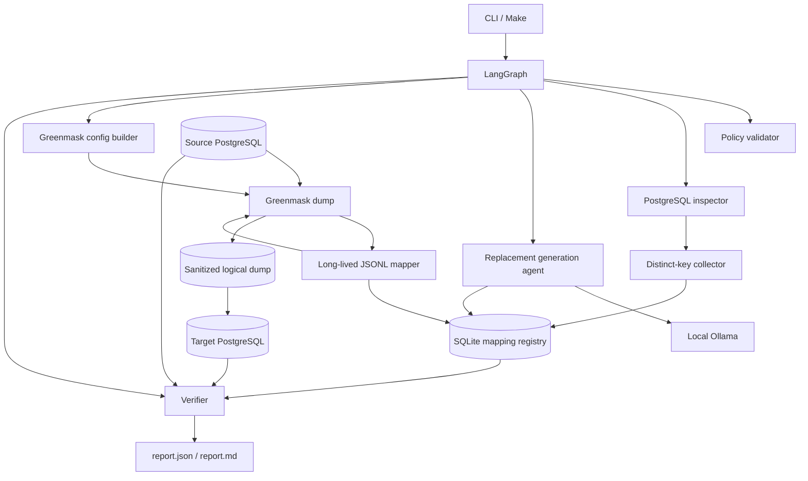
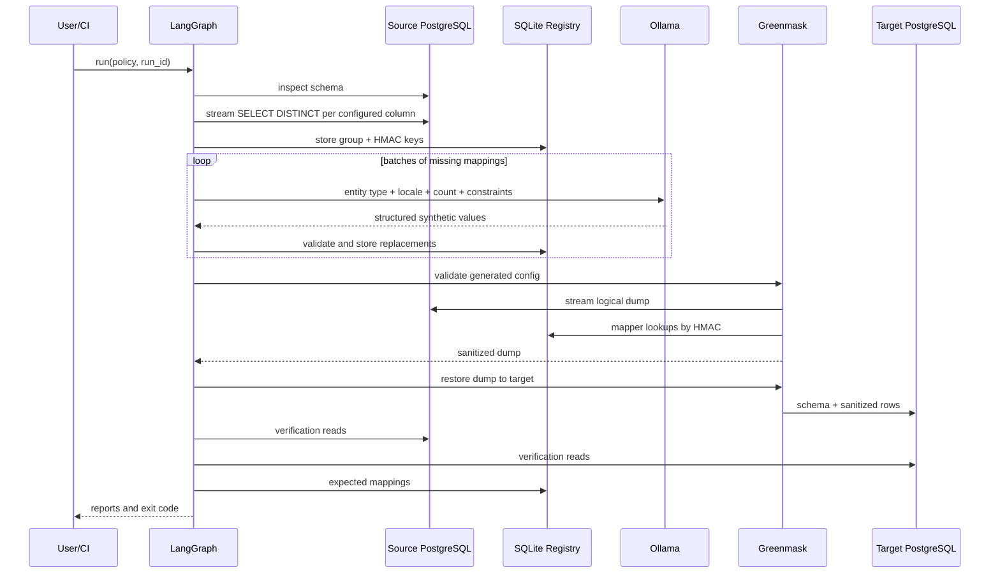

# Архитектура

## 1. Принцип

Система разделена на control plane и data plane.

- **Control plane** управляет шагами, состоянием, генерацией замен и проверками.
- **Data plane** потоково читает БД, применяет готовые mappings и создаёт дамп.

LLM не находится в горячем цикле обработки строк.

## 2. Схема компонентов

Исходник диаграммы отдельно лежит в `templates/architecture.mmd`.

## 3. Последовательность одного запуска

## 4. Ответственность компонентов

### CLI

- разбирает команды;
- загружает env;
- создаёт run directory;
- запускает/возобновляет graph;
- возвращает стабильный exit code.

### Policy validator

- проверяет YAML и env;
- выполняет schema-aware validation;
- запрещает опасные/неподдержанные конфигурации до side effects.

### PostgreSQL inspector

- читает tables, columns, types, PK, FK, UNIQUE;
- вычисляет schema fingerprint;
- определяет ограничения длины групп;
- не читает PII в логи/состояние.

### Distinct-key collector

- читает только настроенные колонки;
- использует server-side cursors;
- сохраняет только HMAC keys;
- дедуплицирует значения между таблицами группы.

### Replacement generation agent

- единственный LLM-узел;
- генерирует значения пакетами;
- использует structured output;
- валидирует и повторяет только недостающее;
- не видит source values.

### Mapping registry

- обеспечивает one-to-one mapping;
- делает повторы консистентными;
- хранит состояние для resume;
- блокирует duplicate replacements.

### Greenmask config builder

- превращает policy в generated Greenmask YAML;
- группирует колонки по таблицам;
- настраивает один mapper process на таблицу;
- не содержит бизнес-логики генерации.

### JSONL mapper

- работает в строковом потоке Greenmask;
- вычисляет HMAC и выполняет SQLite lookup;
- не вызывает LLM;
- fail closed при пропущенном mapping.

### Verifier

- доказывает, что результат пригоден;
- отделён от data plane;
- возвращает машинные check results и итоговый status.

## 5. Почему ссылки сохраняются

В демонстрации surrogate PK/FK (`customers.id`, `orders.customer_id`) не трансформируются, поэтому физические ссылки остаются неизменными.

Дублирующие бизнес-поля (`billing_name`, `contact_email` и т. п.) входят в те же groups, что первичные поля, и получают те же replacements.

Для чувствительного natural key policy validator требует перечислить и parent, и все referencing columns в одной group. В противном случае запуск запрещается до dump.

## 6. Масштабирование

### По количеству строк

- Greenmask читает и преобразует потоково;
- mapper хранит только соединение с SQLite и небольшой prepared cache;
- collector использует server-side cursor;
- row set не материализуется в Python.

### По числу уникальных PII

- mappings персистентны на диске;
- LLM вызывается только для уникальных незаполненных keys;
- batch size настраивается;
- generation можно resume;
- ограничения и retries детерминированы.

MVP не обещает мгновенную генерацию миллионов уникальных LLM-значений. Production extension может заменить SQLite на PostgreSQL/Redis и добавить генерацию больших проверенных synthetic pools, не меняя mapper contract.

### По команде пользователей

CLI/job не хранит глобальное mutable state. Каждый запуск имеет свой `run_id` и directory, поэтому его можно запускать из CI, Airflow, Jenkins, GitLab CI или другого scheduler.

## 7. Расширяемость

### Новая СУБД

Добавляется новый `DatabaseAdapter` и data-plane adapter. Policy, groups, registry, LLM provider и verifier contracts остаются.

### Новый тип данных

Добавляется:

- normalization strategy;
- Pydantic constraints;
- prompt template;
- validator.

Core graph и mapper protocol не меняются.

### Документы и файлы

В будущем Greenmask adapter заменяется на `DocumentAdapter`, который выдаёт/принимает records. Consistency groups и mapping registry остаются общими.

### Новый LLM provider

Реализуется тот же provider interface. Agent node не должен зависеть от Ollama-specific response objects.

## 8. Надёжность и failure model

- каждый LangGraph node имеет чёткий side effect boundary;
- checkpoint создаётся после успешного узла;
- mappings сохраняются транзакционно после каждого batch;
- generated config валидируется Greenmask до dump;
- dump помечается готовым только после успешного завершения;
- target считается готовым только после restore и required checks;
- при любой required check failure exit code не равен нулю;
- resume не разрешается при изменении policy/schema/model/secret fingerprint.

## 9. Threat model для MVP

Защищаем:

- raw значения настроенных чувствительных столбцов;
- credentials source/target;
- HMAC secret;
- mapping registry как чувствительный служебный артефакт.

Основные угрозы:

- PII в логах/exceptions;
- PII в LLM prompts;
- пропущенная колонка в policy;
- missing mapping и тихое сохранение исходного значения;
- нарушение UNIQUE/FK;
- использование source и target одного DSN;
- случайная публикация mapping DB.

Меры:

- explicit policy и schema validation;
- fail closed;
- redaction;
- HMAC вместо raw source в registry;
- local LLM;
- automatic verifier;
- run directory permissions;
- README предупреждает, что completeness зависит от корректности policy.

## 10. Компромиссы

- Явная policy безопаснее и быстрее для тестового, но не находит неизвестные PII автоматически.
- SQLite делает PoC простым, но не является общей высоконагруженной registry для множества параллельных jobs.
- Локальная 4B-модель удобна для запуска, но качество замен ниже крупной модели.
- Before/after разрешён только на synthetic demo, иначе сам отчёт мог бы стать утечкой.
- Полное сохранение сложных статистических распределений не реализуется; one-to-one mapping сохраняет cardinality и повторы.
