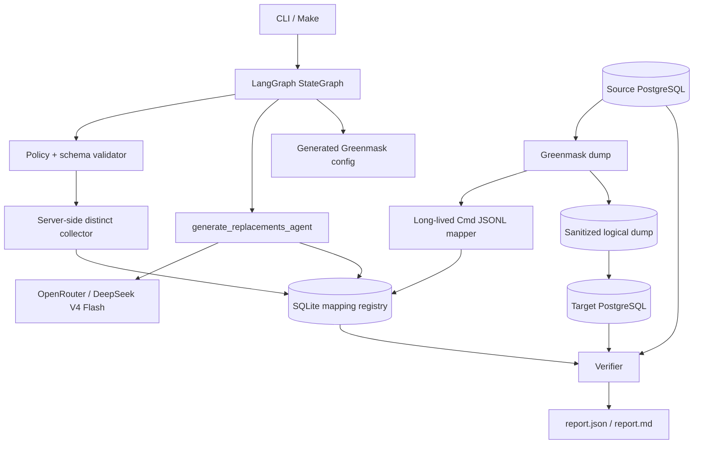

# DB Sanitizer

Контейнеризированный PoC санитизации PostgreSQL: Greenmask выполняет потоковый dump/restore, LangGraph оркестрирует job, SQLite хранит opaque mappings, а LLM генерирует только синтетический пул замен.

## Статус

- Реализовано: source PostgreSQL по DSN → mapping registry → LLM batch generation → Greenmask Cmd JSONL mapping → dump/restore в target → required verification/report.
- Проверено на: Windows 11 10.0.26200, Intel64 Family 6 Model 170, Docker Desktop 28.3.0 / Compose 2.38.1.
- Зафиксированные версии: PostgreSQL 16.14, Greenmask `v0.2.22`, Python 3.12.13, LangGraph 1.2.9, psycopg 3.3.4, Pydantic 2.13.4.
- Runtime LLM: OpenRouter `deepseek/deepseek-v4-flash` со structured JSON output.

> **Явное отклонение от исходного пакета.** По отдельному указанию заказчика локальная Ollama/qwen заменена на OpenRouter DeepSeek V4 Flash. Поэтому Compose не поднимает Ollama, а критерий AC-010 в его исходной формулировке («Ollama») не заявляется как пройденный. Raw PII по-прежнему не отправляются: провайдер получает только тип, locale, count и format constraints.

## Задача и границы

Инструмент создаёт пригодную для development/test/analytics копию PostgreSQL без значений в явно перечисленных чувствительных text/varchar/char колонках. Он сохраняет схему, surrogate PK/FK, строки, `NULL`, UNIQUE и cardinality.

### Реализовано

- PostgreSQL 16 only; source connection и отдельный target;
- entity types: `person_name`, `email`, `phone`, `address`;
- YAML consistency groups без auto-discovery PII;
- normalisation + `HMAC-SHA256(group_id + "\\0" + normalized_value)`;
- SQLite registry без raw source values;
- OpenRouter structured-output adapter и explicit fake provider для test/perf;
- Greenmask 0.2.22 `Cmd` transformer с long-lived Python JSONL mapper;
- LangGraph SQLite checkpoints, `--resume`, fail-closed CLI;
- schema/FK/rows/NULL/UNIQUE/mapping/intersection/diversity verification;
- Docker Compose, demo seed, security tests и 100k-row performance smoke.

### Не реализовано

MySQL/MSSQL, UI/API, Kubernetes, S3, auto PII discovery, NER/OCR/documents/free text, JSON/JSONB masking, subsetting, reversible encryption, cloud control plane, additional entity types и multi-agent workflows.

## Архитектура



Control plane: policy validation, key collection, one LLM agent node, config creation and verification. Data plane: Greenmask streams PostgreSQL rows and asks the mapper only for an existing SQLite replacement; it never invokes an LLM per row.

## OSS и собственные интеграции

| Component | Role | Project code |
|---|---|---|
| PostgreSQL 16.14 | Source and target | Safe inspector, collector, reset and verifier queries |
| Greenmask 0.2.22 | Logical dump, stream transform, restore | Generated YAML, Cmd mapper and safe subprocess runner |
| LangGraph 1.2.9 | Workflow/checkpoints | Typed state and deterministic nodes |
| OpenRouter / DeepSeek V4 Flash | Synthetic pool generation | JSON-schema provider, local validation/retry |
| psycopg 3.3.4 | PostgreSQL access | Read-only source, server-side collector |
| SQLite | Registry/checkpoint files | Opaque mapping schema and compatibility checks |

## Быстрый запуск

### Prerequisites

- Docker Desktop/Engine with Compose v2;
- GNU Make and [uv](https://docs.astral.sh/uv/) for `make test`, `make lint` and `make clean`;
- an OpenRouter API key permitted to call `deepseek/deepseek-v4-flash`;
- approximately 4 GB RAM and free disk for PostgreSQL images/dumps.

```bash
cp .env.example .env
# Replace every placeholder; SANITIZER_HMAC_KEY must be a private random value of >=32 bytes.
# The example HMAC placeholder is intentionally too short, so it cannot be used by accident.
make demo
```

`make demo` always recreates the synthetic source/target volumes, uses **the real OpenRouter model**, and writes:

```text
.runs/demo/
  state.sqlite3
  mappings.sqlite3
  mapper-config.json
  greenmask.generated.yaml
  dump/
  logs.jsonl
  report.json
  report.md
  demo-before-after.md        # synthetic demo only
```

Required CLI commands are:

```bash
db-sanitizer run --policy config/policy.demo.yaml --run-id demo
db-sanitizer run --policy config/policy.demo.yaml --run-id demo --resume
db-sanitizer verify --policy config/policy.demo.yaml --run-id demo
```

`run` with an existing ID fails unless `--resume` is used. `verify` regenerates the safe reports without making LLM calls.

## Policy

`config/policy.demo.yaml` is copied from the normative example and retains its groups/semantics. Connections and secrets are env-variable *names*, never inline DSNs.

```yaml
groups:
  person_name:
    entity_type: person_name
    normalization: human_text
    columns:
      - schema: public
        table: customers
        column: full_name
      - schema: public
        table: orders
        column: billing_name
```

The validator rejects unknown/duplicate/unsupported columns, incompatible lengths, same source/target DSNs, empty groups, partial transformed natural FK/PK relationships, missing env values and a target that is not explicitly allowed to be recreated.

## Сквозные замены

1. Collector uses a named server-side cursor and `SELECT DISTINCT` per declared column.
2. It normalizes the value (`human_text`, `email`, or `phone`) and stores only its group-scoped HMAC key.
3. SQLite enforces one replacement per source key and one normalized replacement per group.
4. LLM gets no raw value, source HMAC, DSN or schema. It generates a synthetic pool from metadata/constraints only.
5. The mapper applies the identical normalisation/HMAC and performs a SQLite lookup.
6. A missing mapping, malformed JSONL, invalid generation or collision fails closed; no source fallback exists.

`NULL` is preserved. Consistency is group-scoped: the same normalized `customers.full_name` and `orders.billing_name` map identically, while an equal string in an unrelated group does not.

## LLM use

The only LLM-owning node is `generate_replacements_agent`. It calls OpenRouter Chat Completions with JSON Schema:

```json
{"items": [{"value": "..."}]}
```

Local Pydantic validation enforces string/length/regex, normalized uniqueness, no source-key collision and all target-column lengths. Invalid values are dropped; a bounded surplus and retries request only non-sensitive synthetic replacements. A sampling seed/temperature and non-sensitive format variation avoid repeated canonical model examples without exposing source data.

Prompt fields are limited to entity type, locale, requested synthetic count and format constraints. Prompts, full model responses, raw values, API keys and DSNs are not written to `logs.jsonl`, LangGraph state, registry or reports.

## Workflow and resume

```text
load_policy
  -> inspect_schema
  -> collect_mapping_keys
  -> generate_replacements_agent
  -> build_greenmask_config
  -> dump_and_restore
  -> verify_and_report
```

Each successful node is checkpointed in `.runs/<run_id>/state.sqlite3` with `thread_id=run_id`. Resume validates policy hash, current schema fingerprint, model/provider and HMAC-key fingerprint via the registry. Mapping assignments and LLM evidence are transactional, so a completed generation node is not repeated.

## Required verification

`report.json` validates against `templates/run-report.schema.json`; `passed` is impossible if any required check is not `pass`.

- source schema fingerprint, table/column/type equivalence;
- per-table row count and per-column `NULL`/distinct count;
- validated FKs and orphan queries;
- PK/UNIQUE definitions, duplicate checks and unchanged surrogate keys;
- PK-aligned registry mapping checks;
- source/target normalized-HMAC nonintersection;
- rejection of a one-value placeholder column.

The Greenmask preflight intentionally does **not** use `validate --strict`: Greenmask emits a generic warning for every `Cmd`-transformed UNIQUE column even when mappings are one-to-one. The independent required UNIQUE verifier is authoritative and fails closed.

## Synthetic before/after

`demo-before-after.md` is a separate artifact and is created only because demo seed data are synthetic. It must never be enabled for a production-like database. It shows PK-aligned examples for all groups and cross-table duplicate fields; `report.json` and `report.md` contain aggregates only.

Illustrative synthetic-only output (actual replacements vary because the real model is sampled):

| Source field(s) | Before | After |
|---|---|---|
| `customers.full_name`, `orders.billing_name` for customer 1 | `Алексей Соколов` | `Павел Степанов` in both tables |
| `customers.email`, `orders.contact_email` for customer 1 | `client001@source.demo` | `synthetic4-022@example.test` in both tables |
| `customers.phone`, `support_tickets.callback_phone` for customer 1 | `8 (999) 200-00-01` | `+7 000 178-64-23` in both tables |

## Tests

```bash
make lint
make test
```

- unit: policy, normalisation/HMAC, registry, LLM retry/structured output, mapper and report contracts;
- security: known PII markers are scanned across registry/config/log/report artifacts;
- integration: Docker-backed fake-provider workflow, resume, and composite-FK regression tests are marked `integration` and require the seeded Compose stack (`DB_SANITIZER_RUN_INTEGRATION=1`).

Tests do not require OpenRouter, an internet connection or a model. `make demo` is the real-model check.

## Performance smoke

```bash
make perf PERF_ROWS=100000
```

The target creates 100 customers, 100,000 orders and 50,000 tickets (150,100 total rows) with only 400 distinct mappings. The target explicitly sets `DB_SANITIZER_USE_FAKE_PROVIDER=1`; this is not a fallback and isolates streaming data-plane throughput from remote LLM latency/cost. It writes `perf-results/benchmark-100000.json` and `.md`.

Measured on the host above:

| Rows | Distinct mappings | Collect | LLM | Dump+transform | Restore | Verify | Peak RSS |
|---:|---:|---:|---:|---:|---:|---:|---:|
| 150,100 | 400 | 9.097 s | 42.481 s | 613.773 s | 9.690 s | 1,524.605 s | 107,737,088 B |

This is a smoke benchmark, not an SLA. The high verifier time reflects Docker Desktop bind-mounted I/O and full PK-aligned proof scans.

## Security

- source connections execute `SET TRANSACTION READ ONLY`;
- credentials/HMAC key are resolved only from environment and never serialized;
- DSNs are redacted in safe error paths;
- all identifiers use `psycopg.sql.Identifier`; all data values are parameters;
- Greenmask subprocesses receive argument lists, never shell interpolation;
- raw transformer/process diagnostics are discarded rather than captured;
- mapping DB and run artifacts use restrictive permissions where supported;
- mapper errors contain table/column plus a short HMAC prefix, never the value.

The mapping database is a sensitive operational artifact even though it lacks raw source strings.

## Scaling and extension points

Rows stream through Greenmask; collector uses bounded cursor batches; mappings are on disk; LLM calls scale with distinct HMAC keys, not row count. `ReplacementProvider`, normalisation, registry and DB/data-plane boundaries are isolated so a future local provider, another DB adapter or document adapter can be added without rewriting mapper semantics.

## Alternatives and trade-offs

- Custom COPY pipeline: rejected because Greenmask already owns dump/restore streaming.
- Greenmask built-ins only: rejected because task requires LLM replacements and centralized mappings.
- PostgreSQL Anonymizer: viable SQL masking alternative, less direct for this registry/LLM PoC.
- Faker-only/per-row LLM: rejected; neither meets the LLM requirement efficiently.
- Cloud LLM: originally rejected, but selected here only by explicit later instruction; metadata leave the local host, raw PII do not.

## Limits

This is a deliberately small PoC. It does not detect unlisted PII, sanitize free text/JSON/documents, support multiple concurrent writers to one registry, guarantee statistical distribution matching, or operate as a production HA/RBAC platform. Policy completeness remains the operator's responsibility.

## Project structure

```text
src/db_sanitizer/     CLI, LangGraph, policy, registry, LLM, Greenmask, verifier
demo/                 synthetic schema, seed and performance seed generator
config/               explicit demo policy
tests/                unit, integration and security tests
scripts/              clean, wait and benchmark helpers
```

## License

MIT. See [LICENSE](LICENSE).
