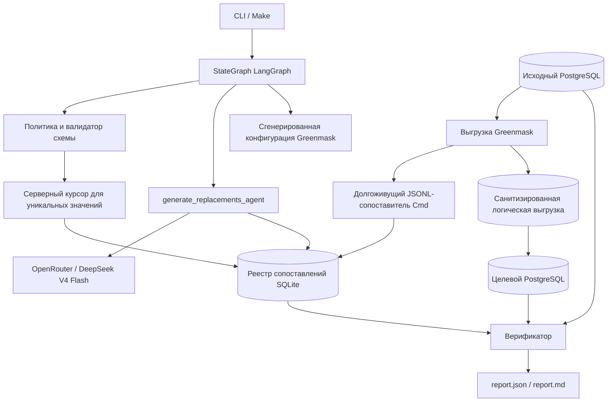

# DB Sanitizer

Контейнеризированный демонстрационный прототип санитизации PostgreSQL: Greenmask выполняет потоковую выгрузку и восстановление, LangGraph оркестрирует задание, SQLite хранит непрозрачные сопоставления, а LLM генерирует только синтетический пул замен.

## Статус

- Реализован маршрут: исходный PostgreSQL по DSN → реестр сопоставлений → пакетная генерация LLM → JSONL-сопоставление Greenmask Cmd → выгрузка/восстановление в целевой PostgreSQL → обязательная верификация и отчёт.
- Проверено на: Windows 11 10.0.26200, Intel64 Family 6 Model 170, Docker Desktop 28.3.0 / Compose 2.38.1.
- Зафиксированные версии: PostgreSQL 16.14, Greenmask `v0.2.22`, Python 3.12.13, LangGraph 1.2.9, psycopg 3.3.4, Pydantic 2.13.4.
- Рабочая LLM: OpenRouter `deepseek/deepseek-v4-flash` со структурированным JSON-выводом.

> **Явное отклонение от исходного пакета.** По отдельному указанию заказчика локальная Ollama/qwen заменена на OpenRouter DeepSeek V4 Flash. Поэтому Compose не поднимает Ollama, а критерий AC-010 в его исходной формулировке («Ollama») не заявляется как пройденный. Исходные PII по-прежнему не отправляются: провайдер получает только тип, локаль, количество и ограничения формата.

## Задача и границы

Инструмент создаёт пригодную для разработки, тестирования и аналитики копию PostgreSQL без значений в явно перечисленных чувствительных столбцах типов text/varchar/char. Он сохраняет схему, суррогатные PK/FK, строки, `NULL`, UNIQUE и кардинальность.

### Реализовано

- Только PostgreSQL 16; соединение с исходной БД и отдельная целевая БД.
- Типы сущностей: `person_name`, `email`, `phone`, `address`.
- YAML-группы консистентности без автоматического поиска PII.
- Нормализация и `HMAC-SHA256(group_id + "\\0" + normalized_value)`.
- Реестр SQLite без исходных значений.
- Адаптер OpenRouter со структурированным выводом и явный тестовый провайдер для тестов и замера производительности.
- Трансформер Greenmask 0.2.22 `Cmd` с долгоживущим Python JSONL-сопоставителем.
- Контрольные точки LangGraph SQLite, `--resume`, CLI с закрытым отказом.
- Верификация схемы, FK, строк, `NULL`, UNIQUE, сопоставлений, пересечений и разнообразия значений.
- Docker Compose, демонстрационные данные, проверки безопасности и проверка производительности на 100 000 строк.

### Не реализовано

MySQL/MSSQL, UI/API, Kubernetes, S3, автоматическое обнаружение PII, NER/OCR, документы и свободный текст, маскирование JSON/JSONB, подмножества данных, обратимое шифрование, облачная управляющая плоскость, дополнительные типы сущностей и мультиагентные сценарии.

## Архитектура



Управляющая плоскость включает валидацию политики, сбор ключей, один агентный LLM-узел, создание конфигурации и верификацию. Плоскость данных потоково обрабатывается Greenmask: он передаёт сопоставителю только запрос на уже существующую замену SQLite и никогда не вызывает LLM для каждой строки.

## Используемые OSS-компоненты и собственные интеграции

| Компонент | Назначение | Код проекта |
|---|---|---|
| PostgreSQL 16.14 | Исходная и целевая БД | Безопасный инспектор, сборщик, очистка и запросы верификатора |
| Greenmask 0.2.22 | Логическая выгрузка, потоковое преобразование, восстановление | Сгенерированный YAML, Cmd-сопоставитель и безопасный запуск подпроцессов |
| LangGraph 1.2.9 | Оркестрация и контрольные точки | Типизированное состояние и детерминированные узлы |
| OpenRouter / DeepSeek V4 Flash | Генерация синтетического пула | Провайдер JSON Schema, локальная валидация и повторные попытки |
| psycopg 3.3.4 | Доступ к PostgreSQL | Соединение только для чтения с исходной БД и серверный сборщик |
| SQLite | Реестр и файлы контрольных точек | Непрозрачная схема сопоставлений и проверки совместимости |

## Быстрый запуск

### Предварительные требования

- Docker Desktop/Engine с Compose v2;
- GNU Make и [uv](https://docs.astral.sh/uv/) для `make test`, `make lint` и `make clean`;
- ключ API OpenRouter с доступом к `deepseek/deepseek-v4-flash`;
- примерно 4 ГБ ОЗУ и свободное место на диске для образов и выгрузок PostgreSQL.

```bash
cp .env.example .env
# Замените все заполнители; SANITIZER_HMAC_KEY должен быть приватным случайным значением длиной не менее 32 байт.
# Заполнитель HMAC в примере намеренно слишком короткий, поэтому его нельзя случайно использовать.
make demo
```

`make demo` всегда заново создаёт синтетические тома исходной и целевой БД, использует **реальную модель OpenRouter** и записывает:

```text
.runs/demo/
  state.sqlite3
  mappings.sqlite3
  mapper-config.json
  greenmask.generated.yaml
  dump/
  logs.jsonl
  report.json
  report.md
  demo-before-after.md        # только синтетическая демонстрация
```

Обязательные команды CLI:

```bash
db-sanitizer run --policy config/policy.demo.yaml --run-id demo
db-sanitizer run --policy config/policy.demo.yaml --run-id demo --resume
db-sanitizer verify --policy config/policy.demo.yaml --run-id demo
```

`run` с уже существующим идентификатором завершается ошибкой, если не указан `--resume`. Команда `verify` заново создаёт безопасные отчёты без вызовов LLM.

## Политика

`config/policy.demo.yaml` скопирован из нормативного примера и сохраняет его группы и семантику. Соединения и секреты задаются *именами* переменных окружения, а не встроенными DSN.

```yaml
groups:
  person_name:
    entity_type: person_name
    normalization: human_text
    columns:
      - schema: public
        table: customers
        column: full_name
      - schema: public
        table: orders
        column: billing_name
```

Валидатор отклоняет неизвестные, дублирующиеся и неподдерживаемые столбцы, несовместимые длины, одинаковые DSN исходной и целевой БД, пустые группы, частично преобразованные связи естественных FK/PK, отсутствующие значения переменных окружения и целевую БД без явного разрешения на пересоздание.

## Сквозные замены

1. Сборщик использует именованный серверный курсор и `SELECT DISTINCT` для каждого объявленного столбца.
2. Он нормализует значение (`human_text`, `email` или `phone`) и сохраняет только HMAC-ключ, ограниченный группой.
3. SQLite обеспечивает одну замену для каждого исходного ключа и одну нормализованную замену для каждой группы.
4. LLM не получает исходное значение, HMAC исходного значения, DSN или схему. Она генерирует синтетический пул только на основе метаданных и ограничений.
5. Сопоставитель применяет идентичную нормализацию/HMAC и выполняет поиск в SQLite.
6. Отсутствующее сопоставление, некорректный JSONL, невалидная генерация или коллизия приводят к закрытому отказу; подстановки исходного значения не существует.

`NULL` сохраняется. Консистентность ограничена группой: одинаковые нормализованные `customers.full_name` и `orders.billing_name` получают идентичную замену, тогда как одинаковая строка в несвязанной группе — нет.

## Использование LLM

Единственный узел, владеющий LLM, — `generate_replacements_agent`. Он вызывает OpenRouter Chat Completions с JSON Schema:

```json
{"items": [{"value": "..."}]}
```

Локальная валидация Pydantic проверяет тип строки, длину, регулярное выражение, уникальность после нормализации, отсутствие коллизии с исходным ключом и допустимую длину во всех целевых столбцах. Невалидные значения отбрасываются; ограниченный избыток и повторные попытки запрашивают только нечувствительные синтетические замены. Параметры случайности выборки и температуры, а также нечувствительное изменение формата предотвращают повторение типовых примеров модели без раскрытия исходных данных.

Поля запроса ограничены типом сущности, локалью, требуемым числом синтетических значений и ограничениями формата. Запросы, полные ответы модели, исходные значения, ключи API и DSN не записываются в `logs.jsonl`, состояние LangGraph, реестр или отчёты.

## Пайплайн и возобновление

```text
load_policy
  -> inspect_schema
  -> collect_mapping_keys
  -> generate_replacements_agent
  -> build_greenmask_config
  -> dump_and_restore
  -> verify_and_report
```

Каждый успешно выполненный узел сохраняется в `.runs/<run_id>/state.sqlite3` с `thread_id=run_id`. При возобновлении проверяются хеш политики, текущий отпечаток схемы, модель/провайдер и отпечаток HMAC-ключа через реестр. Назначения сопоставлений и доказательства работы LLM сохраняются транзакционно, поэтому завершённый узел генерации не выполняется повторно.

## Обязательная верификация

`report.json` проходит проверку по `templates/run-report.schema.json`; статус `passed` невозможен, если хотя бы одна обязательная проверка не имеет статуса `pass`.

- отпечаток исходной схемы, эквивалентность таблиц, столбцов и типов;
- число строк по таблицам и число `NULL`/уникальных значений по столбцам;
- валидированные FK и запросы на поиск сиротских строк;
- определения PK/UNIQUE, поиск дубликатов и неизменность суррогатных ключей;
- проверки сопоставлений реестра с выравниванием по PK;
- отсутствие пересечения нормализованных HMAC исходной и целевой БД;
- отклонение столбца с одной заглушкой для всех значений.

Предварительная проверка Greenmask намеренно **не** использует `validate --strict`: Greenmask выдаёт общее предупреждение для каждого UNIQUE-столбца, преобразованного `Cmd`, даже когда сопоставления являются взаимно однозначными. Независимый обязательный верификатор UNIQUE считается авторитетным и работает с закрытым отказом.

## Синтетическое сравнение до/после

`demo-before-after.md` — отдельный артефакт, который создаётся только потому, что демонстрационные исходные данные синтетические. Его нельзя включать для базы данных, похожей на производственную. Он показывает примеры, выровненные по PK, для всех групп и повторяющихся полей из разных таблиц; `report.json` и `report.md` содержат только агрегаты.

Иллюстративный синтетический вывод (фактические замены меняются, поскольку используется выборка реальной модели):

| Исходные поля | До | После |
|---|---|---|
| `customers.full_name`, `orders.billing_name` для клиента 1 | `Алексей Соколов` | `Павел Степанов` в обеих таблицах |
| `customers.email`, `orders.contact_email` для клиента 1 | `client001@source.demo` | `synthetic4-022@example.test` в обеих таблицах |
| `customers.phone`, `support_tickets.callback_phone` для клиента 1 | `8 (999) 200-00-01` | `+7 000 178-64-23` в обеих таблицах |

## Тесты

```bash
make lint
make test
```

- модульные: политика, нормализация/HMAC, реестр, повторные попытки LLM/структурированный вывод, контракты сопоставителя и отчёта;
- безопасность: известные маркеры PII проверяются в артефактах реестра, конфигурации, логов и отчёта;
- интеграционные: Docker-сценарии с тестовым провайдером, возобновлением и регрессией составных FK помечены `integration` и требуют подготовленный стек Compose (`DB_SANITIZER_RUN_INTEGRATION=1`).

Тесты не требуют OpenRouter, доступа в интернет или модели. `make demo` — проверка с реальной моделью.

## Проверка производительности

```bash
make perf PERF_ROWS=100000
```

Цель создаёт 100 клиентов, 100 000 заказов и 50 000 обращений в поддержку (всего 150 100 строк), но только 400 уникальных сопоставлений. Цель явно устанавливает `DB_SANITIZER_USE_FAKE_PROVIDER=1`; это не резервный режим, а изоляция пропускной способности плоскости данных от задержки и стоимости удалённой LLM. Она записывает `perf-results/benchmark-100000.json` и `.md`.

Измерено на указанном выше хосте:

| Строки | Уникальные сопоставления | Сбор | LLM | Выгрузка и преобразование | Восстановление | Верификация | Пиковый RSS |
|---:|---:|---:|---:|---:|---:|---:|---:|
| 150 100 | 400 | 9,097 с | 42,481 с | 613,773 с | 9,690 с | 1 524,605 с | 107 737 088 байт |

Это проверка работоспособности производительности, а не SLA. Большое время верификатора связано с файловым вводом-выводом Docker Desktop через bind mount и полными проверками с выравниванием по PK.

## Безопасность

- соединения с исходной БД выполняют `SET TRANSACTION READ ONLY`;
- учётные данные и HMAC-ключ извлекаются только из окружения и никогда не сериализуются;
- DSN редактируются в безопасных путях ошибок;
- все идентификаторы формируются через `psycopg.sql.Identifier`, а все значения данных передаются параметрами;
- подпроцессы Greenmask получают списки аргументов, а не строковую интерполяцию оболочки;
- необработанные диагностические сообщения трансформера и процессов отбрасываются, а не сохраняются;
- БД сопоставлений и артефакты запуска используют ограничивающие права там, где это поддерживается;
- ошибки сопоставителя содержат таблицу/столбец и короткий префикс HMAC, но никогда не содержат значение.

База сопоставлений является чувствительным операционным артефактом, хотя и не содержит исходных строк.

## Масштабирование и точки расширения

Строки потоково проходят через Greenmask; сборщик использует ограниченные пакеты курсора; сопоставления хранятся на диске; вызовы LLM масштабируются по числу уникальных HMAC-ключей, а не по числу строк. Границы `ReplacementProvider`, нормализации, реестра и адаптеров БД/плоскости данных изолированы, поэтому в будущем можно добавить локальный провайдер, другой адаптер БД или адаптер документов без переписывания семантики сопоставителя.

## Альтернативы и компромиссы

- Собственный конвейер COPY: отклонён, потому что Greenmask уже обеспечивает потоковую выгрузку и восстановление.
- Только встроенные преобразования Greenmask: отклонены, поскольку задача требует LLM-замены и централизованные сопоставления.
- PostgreSQL Anonymizer: жизнеспособная альтернатива SQL-маскирования, но менее прямая для этого PoC с реестром и LLM.
- Только Faker / LLM для каждой строки: отклонены; ни один подход не выполняет требование к LLM эффективно.
- Облачная LLM: изначально отклонена, но выбрана здесь только по явному позднему указанию; метаданные покидают локальный хост, исходные PII — нет.

## Ограничения

Это намеренно небольшой PoC. Он не обнаруживает неуказанные PII, не санитизирует свободный текст/JSON/документы, не поддерживает нескольких параллельных авторов одного реестра, не гарантирует совпадение статистических распределений и не является производственной платформой HA/RBAC. Полнота политики остаётся ответственностью оператора.

## Структура проекта

```text
src/db_sanitizer/     CLI, LangGraph, политика, реестр, LLM, Greenmask, верификатор
demo/                 синтетическая схема, данные и генератор данных для замера производительности
config/               явная демонстрационная политика
tests/                модульные, интеграционные тесты и тесты безопасности
scripts/              вспомогательные скрипты очистки, ожидания и бенчмарка
```

## Лицензия

MIT. См. [LICENSE](LICENSE).
