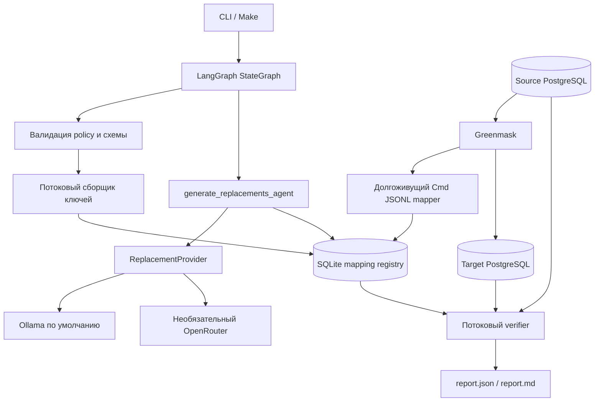

# DB Sanitizer

Контейнеризированный PoC санитизации PostgreSQL. Greenmask потоково создаёт и восстанавливает выгрузку, LangGraph оркестрирует задание, SQLite хранит непрозрачные сопоставления, а LLM создаёт только пул синтетических замен.

## Статус

- Полный путь: source PostgreSQL → HMAC registry → LLM → Greenmask Cmd JSONL mapper → target PostgreSQL → обязательная верификация и отчёт.
- Основной demo-provider: локальный Ollama через `config/policy.demo.yaml` и Compose-профиль `ollama`.
- Необязательный удалённый provider: OpenRouter `deepseek/deepseek-v4-flash` через `config/policy.openrouter.yaml`.
- Тесты не вызывают модель или OpenRouter; Docker нужен только для integration-сценария `make test-all`.
- Зафиксированы PostgreSQL 16.14, Greenmask `v0.2.22`, Python 3.12.13, LangGraph 1.2.9, psycopg 3.3.4 и Pydantic 2.13.4.

Ollama — основной сценарий для получателя задания: `make demo` сам запускает контейнер, загружает выбранную модель и выполняет полный локальный pipeline. OpenRouter оставлен как необязательная удалённая альтернатива. Оба provider получают только нечувствительные метаданные генерации.

## Границы

Инструмент санитизирует явно перечисленные text/varchar/char-столбцы типов `person_name`, `email`, `phone` и `address`. Не входят в PoC: другие СУБД, UI/API, Kubernetes, auto-discovery PII, свободный текст, документы, OCR, JSON/JSONB, subsetting, обратимое шифрование и многопользовательский реестр.

## Архитектура



Граф LangGraph строго линейный:

```text
load_policy -> inspect_schema -> collect_mapping_keys
  -> generate_replacements_agent -> build_greenmask_config
  -> dump_and_restore -> verify_and_report
```

Только `generate_replacements_agent` использует LLM. Greenmask и mapper образуют data-plane: mapper вычисляет HMAC и читает SQLite; он никогда не вызывает модель построчно. Полное описание — [ARCHITECTURE.md](ARCHITECTURE.md).

## Провайдеры

| Provider | Назначение | Policy |
|---|---|---|
| Ollama `qwen3:4b` | Основной локальный demo | `config/policy.demo.yaml` |
| OpenRouter `deepseek/deepseek-v4-flash` | Необязательный удалённый demo | `config/policy.openrouter.yaml` |
| DeterministicSyntheticProvider | Только тесты/performance | Явно включён тестами или `DB_SANITIZER_USE_FAKE_PROVIDER=1` |

Запрос к реальному provider содержит только тип сущности, локаль, число значений, ограничения длины/формата и регулярное выражение. Исходные PII, source HMAC, DSN, схема БД и секреты в него не попадают.

## Быстрый запуск

### 0. Требования

Нужны Git, Docker Desktop/Engine с Docker Compose v2, GNU Make и [uv](https://docs.astral.sh/uv/). На Windows запускайте команды ниже из **Git Bash** или WSL: `Makefile` использует POSIX shell. Docker Desktop должен быть запущен.

```bash
docker compose version
make --version
uv --version
```

Основной сценарий не требует ключа или установленного Ollama: `make demo` сам поднимет Ollama в Docker. Нужны доступ к сети для первого Docker build/скачивания модели, **не менее 8 ГБ памяти, выделенной Docker**, и около 6 ГБ свободного места. На CPU локальная генерация заметно медленнее, чем на GPU.

### 1. Клонирование и настройка `.env`

```bash
git clone https://github.com/CrazyAngelm/db-sanitizer.git
cd db-sanitizer
cp .env.example .env
uv run python -c "import secrets; print(secrets.token_urlsafe(48))"
```

Вставьте напечатанное значение в `SANITIZER_HMAC_KEY=` в `.env`. Остальные значения из `.env.example` подходят для встроенной синтетической базы. `OLLAMA_MODEL=qwen3:4b` — модель основного demo; при необходимости замените её на другую модель из каталога Ollama прямо в `.env`, и `make demo` скачает её автоматически. Policy и `ollama pull` используют одно и то же значение.

`OPENROUTER_API_KEY` заполняйте **только** для необязательной команды `make demo-openrouter`; для `make demo`, `make test` и `make test-all` он не нужен. В PowerShell вместо `cp` используйте `Copy-Item .env.example .env`. Не коммитьте `.env`.

### 2. Выберите сценарий

| Что проверить | Команда | Нужен ключ OpenRouter |
|---|---|---|
| Быстрые unit/security тесты | `make test` | Нет; Docker и `.env` тоже не нужны |
| Основной полный локальный demo с Ollama | `make demo` | Нет |
| Полная Docker integration-проверка | `make test-all` | Нет; нужен заполненный `.env` с HMAC-ключом |
| Необязательный удалённый demo | `make demo-openrouter` | Да |

`make test` не вызывает LLM и не запускает контейнеры. При первом запуске `uv` может скачать зависимости, поэтому ему нужен доступ к package registry.

### 3. Основной локальный demo с Ollama

```bash
make demo
cat .runs/demo/report.md
```

`make demo` автоматически:

1. очищает synthetic PostgreSQL базы и прошлые run-артефакты;
2. запускает Ollama, source PostgreSQL и target PostgreSQL;
3. скачивает модель из `OLLAMA_MODEL`, если её ещё нет в локальном cache;
4. запускает `config/policy.demo.yaml` и выполняет обязательную верификацию.

Успешный отчёт содержит `Status: **passed**` и все проверки со статусом `pass`. Первая загрузка модели может занять время; bootstrap и model pull автоматически повторяются до трёх раз при сетевой ошибке. Проверенный CPU-only запуск `qwen3:4b` обработал 236 mappings за ~55 минут; GPU существенно ускоряет этот этап. Нормальный `make clean` удаляет базы и `.runs/`, но сохраняет cache модели для повторного запуска; чтобы удалить и модель, выполните `make clean-ollama`.

> Default policy/Makefile предназначены только для встроенной синтетической базы. Не используйте их как команду для production-базы.

Артефакты запуска находятся в `.runs/demo/`:

```text
state.sqlite3  mappings.sqlite3  greenmask.generated.yaml  mapper-config.json
dump/  logs.jsonl  report.json  report.md  demo-before-after.md
```

`demo-before-after.md` создаётся только для синтетической demo-базы. `make demo-ollama` оставлен как совместимый псевдоним и записывает результат в `.runs/demo-ollama/`.

### 4. Необязательный OpenRouter demo

```bash
# Сначала укажите действующий OPENROUTER_API_KEY в .env.
make demo-openrouter
cat .runs/demo-openrouter/report.md
```

Этот сценарий использует `config/policy.openrouter.yaml`, не запускает Ollama и может расходовать баланс OpenRouter. Ключ можно создать в [OpenRouter Keys](https://openrouter.ai/keys).

### 5. Повторная верификация и resume

После `make demo` базы остаются запущенными. Следующие команды выполняют CLI **в контейнере** (host-команда `db-sanitizer` не увидит Docker hostname `source-db` без отдельной настройки DSN):

```bash
# Повторить verifier и перезаписать безопасные report.json/report.md без вызова LLM.
docker compose --env-file .env run --rm --no-deps sanitizer \
  verify --policy config/policy.demo.yaml --run-id demo

# Продолжить только прерванный, ещё не завершённый запуск.
docker compose --env-file .env run --rm --no-deps sanitizer \
  run --policy config/policy.demo.yaml --run-id demo --resume
```

Для OpenRouter замените policy на `config/policy.openrouter.yaml` и run ID на `demo-openrouter`. `--resume` проверяет policy hash, schema fingerprint, provider/model и HMAC fingerprint. Для завершённого запуска используйте `verify`, а не `--resume`.

### Если что-то пошло не так

| Симптом | Действие |
|---|---|
| Ошибка про `SANITIZER_HMAC_KEY` | Сгенерируйте и вставьте непустой случайный ключ длиной не менее 32 байт. |
| Не загружается/не находится модель Ollama | Проверьте сеть, свободное место и `OLLAMA_MODEL` в `.env`; затем повторите `make demo`. |
| Нужно заново скачать модель | Выполните `make clean-ollama`, затем `make demo`. |
| Ошибка про `OPENROUTER_API_KEY` | Она относится только к `make demo-openrouter`: укажите ключ или вернитесь к `make demo`. |
| Docker daemon недоступен | Запустите Docker Desktop и повторите команду. |
| Нужны детали failed run | Откройте `.runs/<run-id>/report.md` и `.runs/<run-id>/logs.jsonl`; они не содержат raw PII. |

## Policy, registry и privacy

Policy явно перечисляет consistency groups и столбцы; соединения и секреты задаются именами env-переменных:

```yaml
llm:
  provider: ollama
  base_url_env: OLLAMA_BASE_URL
  model: qwen3:4b
  model_env: OLLAMA_MODEL
```

`model_env` связывает policy с `.env`: это же имя передаётся в `ollama pull`. У Ollama `api_key_env` не требуется. OpenRouter policy находится в `config/policy.openrouter.yaml`. Шаблон: [templates/sanitizer-policy.example.yaml](templates/sanitizer-policy.example.yaml).

Для каждой non-null строки registry хранит только `HMAC-SHA256(secret, group_id + "\0" + normalized_source)`, replacement, HMAC replacement и безопасные метаданные. Ограничения SQLite обеспечивают одно сопоставление на нормализованное исходное значение и уникальность replacement в группе. Партии назначаются атомарно.

Ни исходные PII, ни нормализованные исходные PII не записываются в registry, logs, state/checkpoints или отчёты. Логи используют allow-list полей и не сохраняют provider payload.

## Верификация и fail closed

Все проверки `required`; ошибка dump/restore, mapper, отсутствие mapping или неуспешная проверка дают non-zero exit. `report.json` и `report.md` содержат только агрегаты и статусы.

Verifier читает PostgreSQL именованными server-side cursors через `fetchmany()`. Он не строит полный Python `set`/`Counter` значений: HMAC-мультисеты лежат во временной SQLite work table, а повторные registry lookup ограничены LRU-кэшем. Проверяются:

- отпечаток source schema, таблицы, столбцы, PostgreSQL-типы и длины;
- числа строк, `NULL`/distinct-статистика configured columns;
- PK, UNIQUE, FK и orphan rows;
- точное source→target mapping по безопасному PK либо HMAC-мультисету;
- отсутствие source/target HMAC intersection и single-placeholder коллапса.

PoC автоматически не доказывает эквивалентность `NOT NULL`, `DEFAULT`, identity-параметров, последовательностей, `CHECK`, обычных индексов, `ON UPDATE`/`ON DELETE`, deferrability, views и triggers. Greenmask/pg_dump переносят их штатно, но это вне заявленного автоматического доказательства.

## Проверка качества

```bash
make lint              # Ruff
make test              # unit + security
make test-integration  # Docker integration
make test-all          # test + integration
make perf PERF_ROWS=100000
make perf PERF_ROWS=1000000
make clean
```

Последний прогон `make test` дал **49 passed**. `make test-all` пересоздаёт test stack и проверяет fake workflow, resume и FK-regression в Docker.

### Performance smoke

Измерено на Windows 11 / Intel64 / Python 3.12.13 в Docker с явным fake-provider; fixture имеет 100 уникальных значений на каждую из 4 групп. Это доказывает, что LLM items равны числу уникальных mappings, а не числу строк.

| Запрошено orders | Всего строк | Mappings / LLM items | Dump+transform | Verify | Peak RSS |
|---:|---:|---:|---:|---:|---:|
| 100 000 | 150 100 | 400 / 400 | 2 534.91 rows/s (59.213 s) | 21.651 s | 90 923 008 B |
| 1 000 000 | 1 500 100 | 400 / 400 | 3 979.84 rows/s (376.925 s) | 88.251 s | 91 779 072 B |

Полный воспроизводимый артефакт 1M: [docs/benchmarks/benchmark-1000000.md](docs/benchmarks/benchmark-1000000.md) и [JSON](docs/benchmarks/benchmark-1000000.json).

## Безопасность исполнения

- source и target не могут быть одной базой даже при разных ролях/URI-алиасах;
- shell interpolation отсутствует: subprocess получает список аргументов;
- SQL identifiers валидируются и квотируются через psycopg, значения параметризуются;
- mapper не имеет fallback к исходному значению;
- path traversal артефактов отклоняется;
- credentials и HMAC-key не попадают в report/logs и не коммитятся.

## Структура

```text
src/db_sanitizer/    policy, graph, postgres, mapping, llm, greenmask, verify, CLI
config/              default Ollama и optional OpenRouter policy
demo/                синтетическая схема, seed и performance generator
tests/               unit, security, Docker integration
docs/                benchmark и архив исторических требований
templates/           policy, архитектура, схема отчёта
```

Исторические документы требований находятся в [docs/history](docs/history/README.md); они не являются текущей операционной документацией.

## Лицензия

Учебное тестовое задание. Не использовать production PII без отдельного security review, управления ключами и проверки policy владельцем данных.
